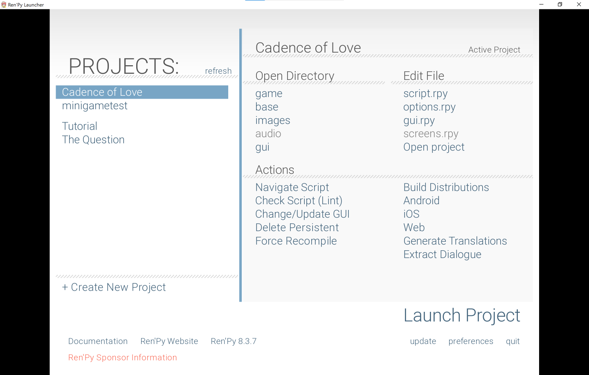

# Cadence Of Love
Casey Ye and Amanda Su's ECE-160 Final Project

## Compiling instructions
- Download Renpy: [Official documentation](https://www.renpy.org/latest.html)
- Move 'Cadence of Love' folder into the same folder as the renpy launcher (should be an .exe file on Windows)
- Open the Renpy launcher
- Click 'Cadence of Love' on the the side bar and click 'Launch project' 
